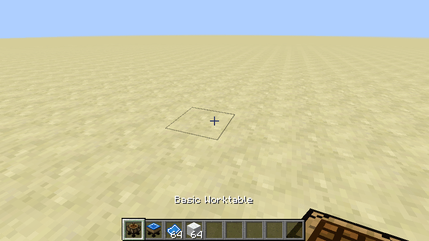

# Design Pattern

When a Designer's table is placed next to any of the other tables, a Design Pattern slot will appear to the left of the other table when its gui is opened.

To use the Design Pattern slot, place a valid recipe in the open table and place a blank Design Pattern in the Design Pattern slot to the left. Next, extract a written pattern from the slot to the right of the blank Design Pattern slot.

The written Design Pattern contains NBT data with the name of the recipe. The written recipe can be used as a recipe ingredient in another recipe. You could also add other ways for players to get those written recipes if you wanted; ie. loot tables, quest rewards.

To clear a written Design Pattern, hold the pattern in your main hand and sneak + use.

The patterns are a step toward automation, but they are still useful without it.