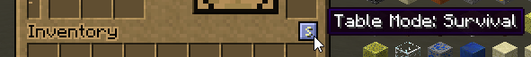
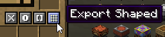
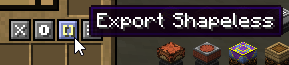
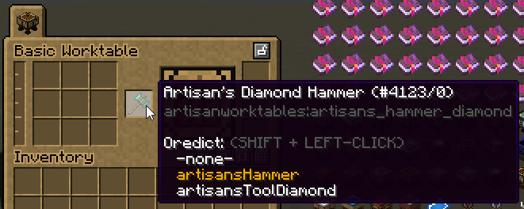
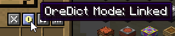
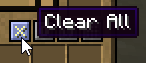

# Creative Tools

Artisan Worktables has some recipe creation tools that can be unlocked by a player in creative mode.

## Creative Mode

To unlock a table's recipe creation tools:

1. First, ensure you are in the `creative` game mode
2. Next, open a table's GUI
3. Finally, click the button indicated in the image

When a table is in creative mode, it will:

* no longer process recipes
* allow you to place ghost items in any slot
* shift-click input slots to cycle an item's ore-dict
* click an occupied slot to clear it
* emit particles to indicate it is in creative mode

## Export Shaped / Shapeless

The export buttons will create a valid recipe builder script from the contents of the table and copy it to the clipboard.

The following will be exported:

* fluids
* input ingredients
* secondary input ingredients
* tools
* output
* secondary outputs

## Ore-Dict

If an input item has ore-dict entries, that item's ghost item can be set to use the ore-dict entry instead. `SHIFT + LEFT-CLICK` any input ghost item in the table to cycle through available ore-dict entries for the item.

A table has two ore-dict modes that govern how ore-dict entries are cycled on input items: `Linked` and `Unlinked`. To cycle between modes, click the button illustrated above.

By default, the ore-dict mode is `Linked` and will cause all input items of the same type to be assigned the ore-dict of the item currently being cycled.

The `Unlinked` mode will allow the ore-dicts of input items to be cycled independently of one another even if the items are of the same type.

## Clear All

Clicking this button will clear the table of its contents.